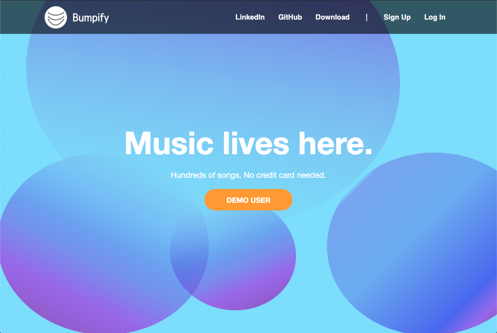
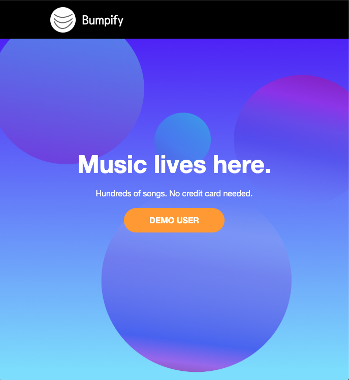

### Bumpify is a music streaming platform inspired by Spotify.
Created by [Ja'Lisha Higgs](https://www.linkedin.com/in/ja-lisha-higgs-b8331a42)

## Highlights:
Bumpify has a vibrant, responsive splash page that welcomes anyone visiting the site.
Clean layout that will allow for a smooth user signup and login experience. 

    
    

## Languages and Tools Used:
* Ruby on Rails
* JavaScript
* React JSX
* Redux
* CSS
* HTML
* PostgreSQL
* AWS S3
* Heroku
* Figma
* FontAwesome

## What's to Come:
### Music Streaming
Play hundreds of songs across all genres in Bumpify's database.

### Continuous Play
Continue listening to music while navigating the app, searching and following their
favorite artists, and adding songs to their queue and various playlists.

### Playlist Creation
Create, view, edit, delete and share playlists. A users liked songs and albums 
will be added to their 'Liked Songs' playlist.

### Social Engagement
Users are able to follow each other, their favorite artists, and public playlists. 

### Search Engine
Retrieves users, artists, albums, songs or playlists that match a given search query.

<!-- 
This README would normally document whatever steps are necessary to get the
application up and running.

Things you may want to cover:

* Ruby version

* System dependencies

* Configuration

* Database creation

* Database initialization

* How to run the test suite

* Services (job queues, cache servers, search engines, etc.)

* Deployment instructions

* ... -->
